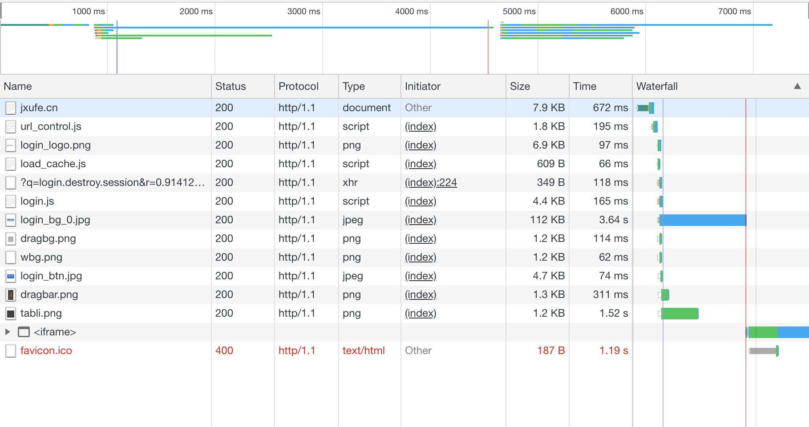

# HTTP/2 协议详解

> 作者保留所有权利。All rights reserved.

- [关于作者](https://jiajunhuang.com/aboutme)

## 目录

* [`HTTP/1.x` 简介](#http1x-简介)
* [回顾 `HTTP/1.x` 的请求流程](#回顾-http1x-的请求流程)
* [`HTTP/2` 简介](#http2-简介)
* [二进制分帧](#二进制分帧)
* [流](#流)
* [头部压缩](#头部压缩)
* [约定的错误](#约定的错误)
* [`SETTINGS` 中可以设置的内容](#settings-中可以设置的内容)
* [如何与 `HTTP/1.x` 兼容](#如何与-http1x-兼容)
* [参考](#参考)

### `HTTP/1.x` 简介

要想深刻的了解 `HTTP/2`，那么我们必须对 `HTTP/1.x` 本身以及它的缺点有一定程度的熟悉，而这一节，我们对 `HTTP/1.x` 的请求
形式以及其缺点进行一个简单的回顾。首先，`HTTP/1.x` 的一个非常明显的特征是它是明文协议，也就是说，所有的内容，人类可以阅读，
例如这是一个简单的请求的样子：

```
GET / HTTP/1.1
Host: jiajunhuang.com
```

这个请求表明，此HTTP请求，请求获取 `jiajunhuang.com` 这个网站的 `/` 的内容，请求方法是 `GET`，使用的协议是 `HTTP/1.1`。

而这个网站很可能会返回如下响应：

```
HTTP/1.1 101 Switching Protocols
Connection: Upgrade
Upgrade: h2c
```

响应中，首先表明响应是使用 `HTTP/1.1`，状态码是 `101`，状态码的含义是 `Switching Protocols`，接下来就是 `HTTP/1.1` 中
的头部，此响应包含两个头部: `Connection`, `Upgrade`。

通过上面的讲解，我们了解到了一些专有名词，为了方便理解后续的内容，我们需要在此作出解释：

- 明文协议：与明文协议对应的名词是二进制协议，这么来简单的理解一下，我们知道ASCII编码是把8个bit读取位一个byte，而这个
byte的类型是char，例如 `a` 对应的二进制是 `0110 0001`，给一串有意义的明文协议的二进制流，我们可以按照8个bit一组，翻译成
可以显示的英文字符。但是二进制协议则不可以，因为尽管我们也可以按照8个bit一组去读取并且显示，但是结果是，我们得到的是
一些看不懂的乱码，例如各种奇奇怪怪的符号。当然，这只是举个例子，实际上二进制流可能不是ASCII编码，可能是UTF-8，那就需要
另外的规则去解析了。
- 客户端：例如使用浏览器浏览网页的例子里，浏览器就是客户端。
- 服务器：例如使用浏览器浏览网页的例子里，生成网页内容的那一方就是服务器。
- 请求：例如使用浏览器浏览网页的例子里，浏览器需要告诉服务器自己想要看什么内容，这个步骤就叫请求。
- 响应：例如使用浏览器浏览网页的例子里，服务器返回给浏览器的网页就是响应。
- 头部：HTTP/1.x 中，请求或者响应分为两个部分，一部分是头部，一部分是payload。头部是最开始的用冒号分隔的那些键值对，例如
`Connection: Upgrade` 和 `Upgrade: h2c` 就是头部。
- 状态码：HTTP/1.x 中规定了一系列数字，我们称之为状态码，例如，200代表成功，400代表客户端所给的请求有问题。

### 回顾 `HTTP/1.x` 的请求流程

如果我们使用浏览器打开一个网站，那么流程通常是这样的，浏览器发送请求：

```
GET / HTTP/1.1
Host: jxufe.cn
```

而响应则是 `http://jxufe.cn/` 首页的内容，是一个网页，其中包含许多图片和CSS以及JS等静态资源，为了展示出最终的结果，浏览器
还需要把这些资源下载到本地并且进行渲染。而由于我们的浏览器并没有开启 `HTTP/1.0` 及以上支持的 `Keep-Alive`，所以对于每一个
资源，浏览器都要新建一个TCP连接去下载资源。例如下图是访问 `http://jxufe.cn` 的网络请求示意图：



从图中我们可以看出来，有大批的资源要下载，而浏览器通常不能新建大量TCP连接，通常的实现是同一个网站开启6个连接。所以如果每个
资源整个流程需要1秒钟，那么下载32个资源，就要32秒钟，这对于用户来说，体验是极差的。即便开启了 `Keep-Alive` ，由于
[Head-of-line Blocking](https://en.wikipedia.org/wiki/Head-of-line_blocking) 的问题，也无法充分利用底层的TCP连接。

此外，如果我们点开每一个请求细看，我们可以发现，头部中有大量的重复内容，例如：

```
Host: jxufe.cn
Accept: text/html,application/xhtml+xml,application/xml;q=0.9,image/webp,image/apng,*/*;q=0.8
User-Agent: Mozilla/5.0 (Macintosh; Intel Mac OS X 10_14_0) AppleWebKit/537.36 (KHTML, like Gecko) Chrome/69.0.3497.100 Safari/537.36
```

等等。当请求量一大，这些重复的头部其实浪费了很多资源。

而 `HTTP/2` 就是为了解决上述问题而设计的。

### `HTTP/2` 简介

首先我们点开这个网站来看看 `HTTP/2` 和 `HTTP/1.1` 在性能，或者说用户体验上的区别：https://imagekit.io/demo/http2-vs-http1

- 扩展：字节序
- 所有数值都是网络序

### 二进制分帧

- 为何分帧
- 帧的类型及其格式
- Go代码解析示例

### 流

- 为什么要有流
- 流的ID
- 状态机以及状态转换
- 流的优先级
- flow control
- 错误处理

### 头部压缩

- 扩展：哈夫曼编码

### 约定的错误

### `SETTINGS` 中可以设置的内容

### 如何与 `HTTP/1.x` 兼容

## 参考

- https://tools.ietf.org/html/rfc7540
- https://tools.ietf.org/html/rfc7541
- https://developers.google.com/web/fundamentals/performance/http2/
